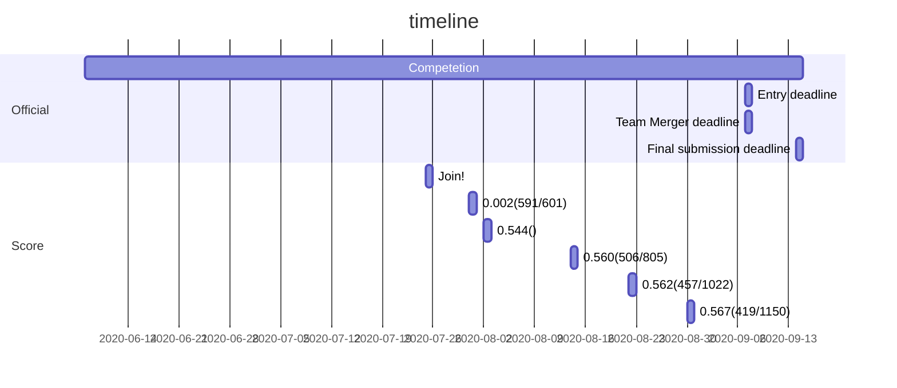

# nishika_prediction_of_second-hand_apartment_2022winter

# nishika_prediction_of_second-hand_apartment_2022winter
Cornell Birdcall Identification コンペのリポジトリ

- result
  - public: 0.566
  - private: 0.599
  - rank: 114/1390

    


- directory tree
```
Kaggle-Cornell-Birdcall-Identification
├── README.md
├── data         <---- gitで管理するデータ
├── data_ignore  <---- .gitignoreに記述されているディレクトリ(モデルとか、特徴量とか、データセットとか)
├── nb           <---- jupyter lab で作業したノートブック
├── nb_download  <---- ダウンロードした公開されているkagglenb
└── src          <---- .ipynb 以外のコード
```

## Pipeline
- 実行例
  ```bash
  python3 pipeline.py --globals.balanced=1 --globals.comment=test
  ```

- 結果の表示例
  ```bash
  python3 show_result.py -d 0
  ```


## Info
- [issue board](https://github.com/fkubota/kaggle-Cornell-Birdcall-Identification/projects/1)   <---- これ大事だよ
- [google slide](https://docs.google.com/presentation/d/1ZcCSnXj2QoOmuIkcA-txJOuAlkLv4rSlS7_zDj90q6c/edit#slide=id.p)
- [flow chart](https://app.diagrams.net/#G1699QH9hrlRznMikAEAE2-3WTjreYcWck)
- [google drive](https://drive.google.com/drive/u/1/folders/1UDVIKTN1O7hTL9JYzt7ui3mNy_b6RHCV)
- ref:
  - [metricについて](https://www.kaggle.com/shonenkov/competition-metrics)
- docker run 時にいれるオプション
  - `--shm-size=5G`

## Timeline




## Dataset
|Name|Detail|Ref|
|---|---|---|
|SpectrogramDataset|5秒のSpectrogramを取得する。audiofileが5秒より短い場合、足りない部分に0 paddingする。5秒より長いものはランダムに5秒の部分を抽出する。|[公開ノートブック(tawaraさん)](https://www.kaggle.com/ttahara/training-birdsong-baseline-resnest50-fast)|
|SpectrogramEventRmsDataset|(バグ有り)SpectrogramDataset(SD)を改良。SDでは、鳥の鳴き声が入っていない部分を抽出する可能性があったのでそれを回避するために作った。librosa_rmsを使用し、バックグラウンドに比べてrmsが大きい値を取る時evet(birdcall)とした。|nb012|
|SpectrogramEventRmsDatasetV2|SpectrogramEventRmsDatasetにバグがあった(nb015)のでfix。|nb015|
|SpectrogramEventRmsDatasetV3|SpectorgramEventRmsDatasetV2を高速化。(nb017で作ったデータフレームを使用)|nb018|
|SpectrogramEventRmsDatasetV4|1sec 専用Dataset。V3で煩わしかった境界問題に対処した。|nb021|
|PANNsDatasetMod|PANNs用。とはいえSpectrogramDatasetとほとんど同じ。スペクトログラムは計算せずに、signalをPANNsに渡すようになってる。|nb024|
|PANNsDatasetEventRmsDataset|PANNs用。nb017_event_rmsを使用してevent部分で学習している。|nb025|
|SpectrogramEventRandomDataset|nb034のeventデータを使う。event部分だけだと、小さな鳥の鳴き声が学習に入らない可能性があるため、event+random_cropを行なう。ratioパラメータがあり、足すeventの大きさを変えられる。|nb043|

## Event
|Name|Detail|Ref|
|---|---|---|
|nb017_event_rms|liborsaのrmsを使用。ラウドネスを見ていると思えばいい。|nb017|
|nb034_event_intensity_500to16000hz|500~16000HzのスペクトルのIntensityをが大きいところをevent部分としている。|nb034|


## Features
|Name|shape (feat only)|size(MB)|Detail|
|---|---|---|---|
|nb004_librosa_mfcc.csv|(21,375, 11)|2.0|librosaのmfcc(2~12)。audiofile1つにつき1ベクトル。srを揃えてないので周波数空間の大きさに差が有り問題がありそう。srを16kHzとかにそろえたほうがいいと思う。|
|nb007_librosa_mfcc02.csv|(4,779,859, 11)|436.1|nb004の特徴量の拡張。audiofile内のn_feat/m_audio/1_bird。nb004の特徴量よりかなりデータ数が多い。|
|nb008_librosa_basic|(4,779,859, 12)|482.7|['rms', 'centroid', 'sc_1', 'sc_2', 'sc_3', 'sc_4', 'sc_5', 'sc_6', 'sb', 'sf', 'sr', 'zcr']。nb004と同じくsrを揃えていない問題がある。|
|nb010_librosa_rms.csv|(4779859, 3)|144|event部分だけ抽出する際のthresholdとして使う。|

## Paper
|No.|Status|Name|Detail|Date|Url|
|---|---|---|---|---|---|
|01|<font color='gray'>Done</font>|音響イベントと音響シーンの分析|日本語記事。まず最初に読むとよい。|2018|[url](https://www.jstage.jst.go.jp/article/jasj/74/4/74_198/_pdf)|
|02|<font color='green'>Doing</font>|PANNs: Large-Scale Pretrained Audio Neural Networks for Audio Pattern Recognition|アライさんがSEDの説明ノートブックで参照していた論文|201912|[url](https://arxiv.org/abs/1912.10211)|
|03|<font color='gray'>Done</font>|Recognizing Birds from Sound - The 2018 BirdCLEF Baseline System|鳥の鳴き声を検出するコンペ？のベースライン。nocall除去についての方法が書かれていた。さらに、nocall部分をノイズとして加えたaugmentationがかなり効いたみたい。鳴き声は0.5~12kHzに集中するらしい。|201804|[url](https://arxiv.org/abs/1804.07177)|
|04|<font color='orange'>Todo</font>|ResNeSt: Split-Attention Networks|ResNeSTの原論文|202004|[url](https://arxiv.org/abs/2004.08955#:~:text=Our%20network%20preserves%20the%20overall,networks%20with%20similar%20model%20complexities.)|
|05|<font color='gray'>Done</font>|Weakly Labelled AudioSet Tagging with Attention Neural Networks|DCASEについての論文。弱ラベルのタスクについて。|2019|[url](https://arxiv.org/abs/1903.00765)|
|06|<font color='gray'>Done</font>|Robust Audio Event Recognition with 1-Max Pooling Convolutional Neural Networks|音響イベント検知についての論文。1-Max Poolingについて。|201604|[url](https://arxiv.org/abs/1604.06338)|
|07|<font color='gray'>Done</font>|Adaptive pooling operators for weakly labeled sound event detection|弱ラベルの音響イベント検知についての論文。|201804|[url](https://arxiv.org/abs/1804.10070)|
|08|<font color='gray'>Done</font>|Guided Learning Convolution System for DCASE 2019 Task 4|DCASE TASK4(SED)の論文。CNNについて。|201909|[url](https://arxiv.org/abs/1909.06178)|
|09|<font color='gray'>Done</font>|Learning Sound Event Classifiers from Web Audio with Noisy Labels|ノイズが入ったラベルについて。|201901|[url](https://arxiv.org/abs/1901.01189)|
|10|<font color='gray'>Done</font>|SpecAugment: A Simple Data Augmentation Method for Automatic Speech Recognition|SpecAugmentの原論文。|201904|[url](https://arxiv.org/abs/1904.08779)|
|11|<font color='gray'>Done</font>|SPECMIX: A SIMPLE DATA AUGMENTATION AND WARM-UP PIPELINETO LEVERAGE CLEAN AND NOISY SET FOR EFFICIENT AUDIO TAGGING |SpecMixの原論文。SpecAugmentに影響を受けている。|2019|[url](http://dcase.community/documents/challenge2019/technical_reports/DCASE2019_Bouteillon_27_t2.pdf)|
|12|<font color='gray'>Done</font>|Large-ScaleBird SoundClassificationusing Convolutional Neural Networks|鳥の鳴き声をDLで検知する論文。nocall部分を除去する方法が知りたくて読む。|2017|[url](http://ceur-ws.org/Vol-1866/paper_143.pdf)|
|13|<font color='gray'>Done</font>|Audio Based Bird Species Identification usingDeep Learning Techniques|鳥の鳴き声をDLで検知する論文。テクニックがいろいろ載ってるっぽい。nocall部分を除去する方法が知りたくて読む。|2016|[url](http://ceur-ws.org/Vol-1866/paper_143.pdf)|
|14|<font color='gray'>Done</font>|GENERAL-PURPOSE TAGGING OF FREESOUND AUDIO WITH AUDIOSET LABELS:TASK DESCRIPTION, DATASET, AND BASELINE|freesound audio tagging compのベースライン論文。とくに有用な情報はなかった。|2018|[url](https://arxiv.org/abs/1807.09902)|
|15|<font color='orange'>Todo</font>|[DL輪読会] Residual Attention Network for Image Classification|日本語のスライド。Resnet+Attensionについて|201709|[url](https://www.slideshare.net/DeepLearningJP2016/dl-residual-attention-network-for-image-classification)|


## Freesound Audio Tagging 2019
|Status|Name|Detail|Date|Url|
|---|---|---|---|---|
|<font color='gray'>Done</font>|Freesound 7th place solution|アライさんたちのチームの解法。Strength Adaptive CropとCustom CNNが良さそう。|2019|[url](https://www.kaggle.com/hidehisaarai1213/freesound-7th-place-solution)|
|<font color='gray'>Done</font>|kaggle Freesound Audio Tagging 2019 4th place solution|freesound audio tagging 2019 4th solution。日本語資料。オレの誕生日に発表してるから良い資料のはず。signal base, image base 両方取り入れている。|20190713|[url](https://www.slideshare.net/ssuser20fb43/kaggle-freesound-audio-tagging-2019-4th-place-solution-156063956)|


## Memo
- term
  - nb: ノートブック
  - kagglenb: kaggleのサイトで見れる/作れるノートブック
- public LBの54%がnocallらしい。(https://www.kaggle.com/c/birdsong-recognition/discussion/159492)

## Basics
**Overview(DeepL)**

窓の外で鳥のさえずりが聞こえてきませんか？世界には1万種以上の鳥が生息しており、手つかずの熱帯雨林から郊外、さらには都市部まで、ほぼすべての環境に生息しています。鳥は自然の中で重要な役割を果たしています。鳥は食物連鎖の上位に位置し、下層で発生している変化を統合します。そのため、鳥は生息地の質の低下や環境汚染の指標として優れています。しかし、鳥は目で見るよりも耳で聞く方が簡単なことが多い。適切な音の検出と分類があれば、研究者は鳥の個体数の変化に基づいて、その地域の生活の質に関する要因を自動的に直感的に把握することができます。

自然の音風景を長期間にわたって連続的に記録することで、鳥類を広範囲に監視するプロジェクトがすでに多く進行中である。しかし、多くの生物や非生物はノイズを発生させるため、これらのデータセットの分析は、多くの場合、専門家が手作業で行っています。このような分析は非常に時間がかかり、結果も不完全なものになりがちです。データサイエンスが助けになるかもしれないので、研究者たちはAIモデルを訓練するために、鳥類の集音録音の大規模なクラウドソースのデータベースに目を向けている。しかし残念なことに、トレーニングデータ（個々の鳥の短い録音）と、モニタリングアプリケーションで使用されるサウンドスケープ録音（複数の種が同時に鳴いていることが多い長い録音）の間には、領域的なミスマッチがあります。これが、現在使用されているAIモデルの性能が低い理由の一つです。

これらの広範で情報量の多いサウンドアーカイブの可能性を最大限に引き出すためには、研究者は、データ駆動型の保存を支援するために、可能な限り多くの情報を確実に抽出する優れた機械リスナーが必要です。

コーネル大学鳥類学研究所の保全生物音響センター（CCB）の使命は、自然界の音を収集し、解釈することです。CCB は革新的な保全技術を開発し、世界中の野生生物や生息地の保全に貢献しています。CCBはデータサイエンスのコミュニティと協力して、その使命をさらに高め、サウンドスケープ分析の精度を向上させたいと考えています。

このコンテストでは、サウンドスケープの録音物に含まれる多種多様な鳥の発声を特定します。録音が複雑なため、ラベルが弱いものが含まれています。人為的な音（例：飛行機の空飛ぶ音）やその他の鳥や非鳥の鳴き声（例：シマリスの鳴き声）が背景にあり、ラベル付けされた特定の鳥の種が前景にあるかもしれません。複雑なサウンドスケープの録音を分析するための効果的な検出器と分類器を構築するために、あなたの新しいアイデアを持ってきてください!

成功すれば、あなたの研究は、研究者が生息地の質の変化、汚染のレベル、修復作業の効果をよりよく理解するのに役立ちます。信頼性の高い機械リスナーはまた、保全活動家が世界中でより多くの録音ユニットを展開することを可能にし、まだ不可能な規模でのデータ駆動型の保全を可能にします。最終的な保全の成果は、鳥類や人間を含む多くの生物の生活の質を大きく向上させる可能性があります。

**data(deepL)**   
隠されたtest_audioディレクトリには、MP3形式の約150の録音が含まれています。これらの録音はノートパソコンのメモリには同時に収まりません。録音は北米の3つの離れた場所で行われました。サイト1と2は5秒単位でラベル付けされており、予測値と一致する必要がありますが、ラベル付けプロセスに時間がかかるため、サイト3のファイルはファイルレベルでのみラベル付けされています。そのため、サイト3はテストセットの行数が比較的少なく、より低い時間分解能の予測が必要です。 別のデータソースからの2つのサウンドスケープの例も、サウンドスケープがどのようにラベル付けされているかと、隠しデータセットのフォルダ構造を説明するために提供されています。2つの例の音声ファイルはBLKFR-10-CPL_20190611_093000.pt540.mp3とORANGE-7-CAP_20190606_093000.pt623.mp3です。これらのサウンドスケープは、カリフォルニア科学アカデミー鳥類哺乳類学科のJack Dumbacher氏のご厚意により提供されました。

### train.csv colomn infomaiton
notebook: nb001
example: https://www.xeno-canto.org/134874

|name|Explanation|
|----|----|
|rating|録音の質を表す(A,B,C,D,Eの5段階)|
|playback_sed|...|
|ebird_code|名前。nunique=264|
|channels|チャンネル数。2種類('1 (mono)', '2 (stereo)')|
|date|録音日。yyyy-mm-ddで記述されている。<-- すべてそうなってるかは確認していない。|
|pitch|'Not specified', 'both', 'increasing', 'level', 'decreasing'の5種類。nb001でそれぞれの音を聞いてみた。(log20200730), 正直何を表しているかわからん。|
|duration|audioファイルの再生時間。単位はseconds。|
|filename|そのままの意味。filenameにかぶりはなし(nb001)。|
|speed |Not specified, level, both, accelerating, decelerating の5種類。音を聞いたけど何が違うのか全然わからん。 |
|species|264種類。今回のクラス数と一緒だな。ebird_codeと一対一？|
|number_of_notes|サイト見たけど、何の数かわからん。['Not specified', '1-3', '4-6', '7-20', '>20']の5種類|
|title|\<filename> \<鳥名> ?? の形式で書かれている。|
|secondary_labels|メインの鳥の鳴き声以外のラベル。|
|bird_seen|集音時に鳥を見たかどうか。|
|sci_name|学名？|
|location|集音場所|
|latitude|緯度|
|sampling_late|サンプリングレート|
|type|song, call, fightなどある|
|elevation|標高。'1400 m' みたいな感じで入ってるが、string型。'? m' もある。|
|descriptin|audiofileにかかれているメタデータ。|
|bitrate_o_mp3|stringで'128000 (bps)'のように格納されているが、8個だけNaNになっている(nb001)|
|file_type|4種類。それぞれの個数はmp3=21367, wav=6, mp2=1, aac=1となっている。|
|volume|'Not specified', 'both', 'increasing', 'level', 'decreasing'の5種類。またこの指標出た。意味がわからん。|
|background|背景音。xeno-cantにも記述されている。secondaly_labelsとどう違うのだろうか。|
|xc_id|filenameにある、XCと拡張子を除いた部分。例(XC134874.mp3 の134874がそれに当たる。重複なく各要素はユニーク。)|
|url    |xeno-cant へのリンクURL|
|country|集音した国|
|author|集音者|
|primary_label|ebird_code は primary_labelの略っぽい。例: Empidonax alnorum_Alder Flycatcher	--> aldfly|
|longitude|経度|
|length|'Not specified', '0-3(s)', '6-10(s)', '>10(s)', '3-6(s)' が要素にある。'Not specified' がダントツで多い。|
|time|集音開始時刻。朝が多め。|
|recordist|調べてみたら(nb001)、authorとrecordistは完全に一致してた。|
|license|4種類あった。あまり有用な情報ではないだろう。|


## Log
### 20200726
- join!!
- spectrogram-treeを使って確認してる。
  - フィルタが入ってるデータとか多いな...

| not filter                                                                  | filter                                                                      |
| --------------------------------------------------------------------------- | --------------------------------------------------------------------------- |
|  |  |
|  |  |
|                                                                             |                                                                             |

- なんか音声ファイルにコメントがあったぞ。

- うーん。とりあえず、提出方法を理解してみよう。

### 20200727
- テストデータはカーネルにしかないのか？
- train.csv
  - nb001
  - train.csvのよくわからないカラムの意味は[ここ](https://www.xeno-canto.org/134874)見ればよさそう。

  | train.csv   | train.csvに記載のurl先  |
  | --- | --- |
  |     |   |
  - playback_used と bird_seen のnull数が一致してる。
  - secondary_labelには、メイン(primary_label)以外の鳥の鳴き声などが入ってる...。どうすんのこれ。
  - bird_seen がNoなのは、声は聞いたが見ていないということ。
  - filetypeはわずかだが、mp3以外もあるようだ
  
### 20200729
- discussionにlibroa.load()について投げた
    - https://www.kaggle.com/c/birdsong-recognition/discussion/170749

### 20200730
- xeno-cantoのレーティングの目安
    A: Loud and Clear
    B: Clear, but bird a bit distant, or some interference with other sound sources
    C: Moderately clear, or quite some interference
    D: Faint recording, or much interference
    E: Barely audible

- nb001
    - pitchの、increasing, decreasing, both, level の確認を行った
    - ebird_codeと鳥名の関係がわかった。ebird_codeは鳥名の略。
      


